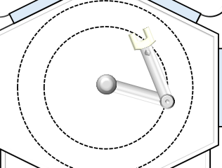
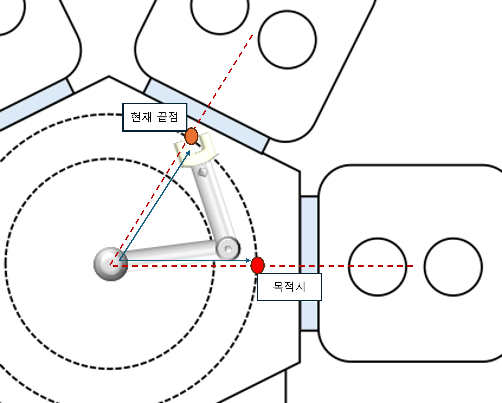
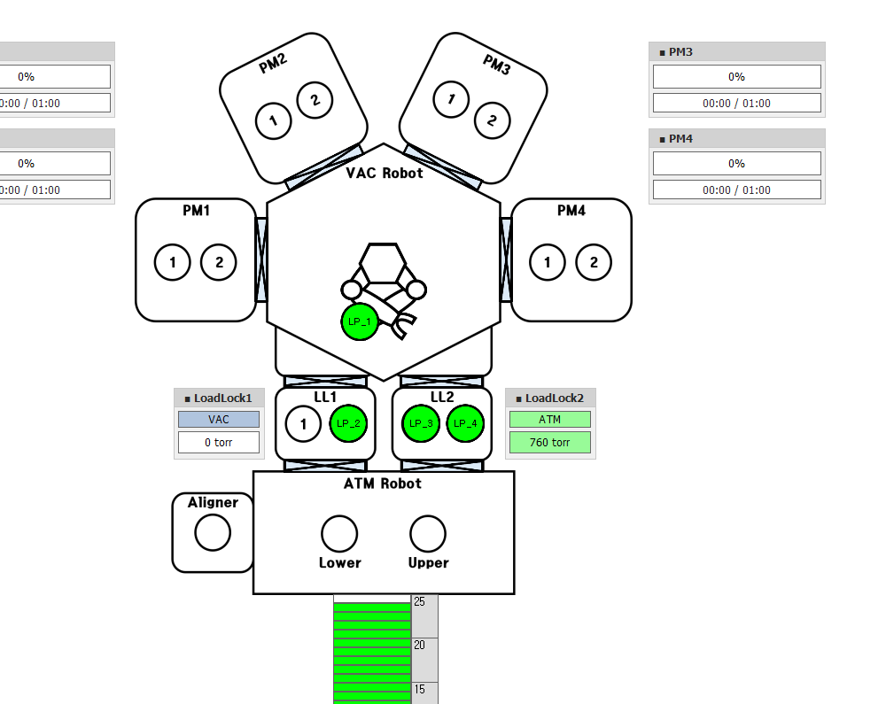
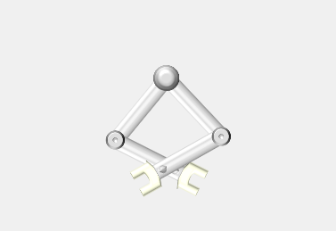
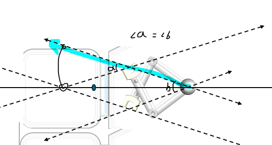
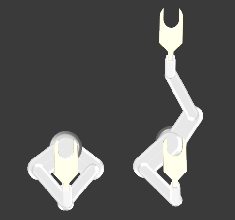

# Winform_RobotArmUI
윈폼으로 로봇팔 접었다 폈다 구현 방안 연구 리포지토리

## 개발 목표
- CTC 만드는 데 사용할 로봇팔 UI 연구, 본 연구가 성공적으로 마무리 된다면 실제 프로젝트에 투입될 예정 
- 2축 & 3축 로봇팔 구현

### 참고 소스
- 어떻게 시작해야 하나 ppt로 그려 보면서 고민하다, 감사하게도 깃허브에서 [로봇팔이 구현된 Unity 코드](
https://github.com/ctw0727/2D_Robotic_Arm/blob/main/KR_RoboticArmPrecoding.cs)를 찾을 수 있었다.

### 1. 2축 로봇팔 구현하기 (Winform_RobotArmUI_)
- 오픈소스 덕에 로봇팔 구현 자체는 어렵지 않았다. 조금 고쳐서 나온 결과물 (알고리즘 이해하려고 기구학도 잠깐 공부했다.)
 [_link](./Resource.README/처음%20로봇팔.mp4)

https://github.com/user-attachments/assets/23728311-8e1a-47cb-ad5a-050c92f57d9a

- 로봇팔 이미지를 넣었더니 구겨지더라, 이미지를 가로로 잘 돌려 둔 이미지를 활용하자.

    
    

- 기존 ctc 샘플 이미지 위에 올려두기 까지 구현
[_link](./Resource.README/이미지%20로봇팔.mp4)

https://github.com/user-attachments/assets/13d923b8-6212-45fe-80df-80271a11bde4

### 2. 로봇팔 애니메이션 구현
- 우선 로봇팔 UI가 구리다는 피드백을 받아 로봇팔을 새로 만들었다. 훨 낫다

    

- 애니메이션 효과를 구현했음. 원하는 모듈을 향해 로봇팔이 움직이도록 구현. 
[_link](./Resource.README/UI와%20애니메이션%20업데이트.mp4)

https://github.com/user-attachments/assets/a0a0b0e0-ac83-4257-8b5c-e860ee47ca30

- 구현 과정에서 선형 동작과 직선 동작을 분리하였음 (끝점 가준)

- 그러나 원하는 동작이 아니었다. 
    1. 회전 중에 펴지지 않아야 함
    2. 접히지 않은 상태라면 회전할 수 없음

- 회전 조건 제약은 간단하지만, 회전 중에 펴지지 않는 것을 어떻게 구현할까 고민.

    
    
    - 목적지 방향을 정한 뒤, root와 끝점 사이 거리만큼 목적지 방향으로 이동한 좌표로 선형 동작하는 방법 구상
    
- 성공 
[_link](./Resource.README/접은%20채로%20회전.mp4)

https://github.com/user-attachments/assets/90a331ab-afa1-4fba-b07e-be61aecbe987

### 3. 두 번째 팔 구현
- LowerArm, UpperArm이 구현되어야 CTC에 적용이 가능함

    

    - (자료화면) 이전에 만들었던 CTC 샘플 화면

- 최초에 테스트했던 모달폼에 두 번째 팔 시범 구현

    
    
    - 첫 번째 팔을 기준으로 일정 각도 만큼 틀어서 생성
    - 첫 번째 팔의 끝점(이 화면에선 마우스)이 root와 멀어지면 두번째 팔 끝점은 루트와 가까워지는 방식

- 그대로 메인 폼으로 가져오기 (with. UI 개선)

    

- 두번째 팔 접기&펴기, 위치 조정 기능 구현 완료 
[_link](Resource.README/두번째팔%20제어%20완료.mp4)

https://github.com/user-attachments/assets/7429303e-8f15-45d9-a1e4-6487abc8a88a

### 4. 양팔 동작 개선

- 개선 전: 양팔 넣었다 빼려면
    1. LowerArm이 목적지를 바라보도록 회전
    2. LowerArm을 뻗었다가 접는다
    3. UpperArm이 목적지를 바라보도록 회전
    4. UpperArm을 뻗었다가 접는다

- 개선 후:
    1. 로봇의 중앙이 목적지를 바라보도록 회전
    2. LowerArm을 뻗었다가 접는다
    3. UpperArm을 뻗었다가 접는다

    

- 개선 방법

    

- 팔을 뻗을 지점에서 양팔 사이 각의 절반만큼 각도를 돌린 지점에 팔이 가도록 하니 됨.
- 접을 때도 비슷한 방식으로
[_link](Resource.README/팔%20동작%20개선.mp4)

https://github.com/user-attachments/assets/755c1088-d359-4cf7-becd-488135d4f86a

### 5. 3축 로봇팔 구현 (Winform_RobotArmUI_new)

- 디자인 구상
 
    

- 3축 테스트 구현 성공
[_link](Resource.README/3축%20로봇팔%20테스트%20구현%20성공.mp4)

https://github.com/user-attachments/assets/e832996d-10b7-4f95-936d-1392eee2cf98

- 루트를 기준으로 손목 위치가 상하/좌우로 넘어갈 때마다 팔꿈치가 180도 반전이 되어 버리는 문제를 3시간 끝에 해결! (성공하고 사무실에서 울부짖음)

- 코사인으로 위치를 구할 경우 두 가지 해를 가지기 때문에 더 가까운 해를 선택하여 위같은 현상이 발생

- 이전 프레임의 팔꿈치 위치와 더 가까운 해를 선택하는 방식으로 문제 해결

- 메인폼으로 양팔 구현하기 성공 [_link](./Resource.README/3축팔%20메인폼%20구현%20성공.mp4)

https://github.com/user-attachments/assets/7bc8e8f8-fa09-487f-bf5e-9e5f1ec0d814

### 6. 3축 로봇팔 + 웨이퍼 이동 구현
- 3축 로봇팔 + 웨이퍼 이동 구현 성공 [_link](Resource.README/wafer%20이동%20구현.mp4)