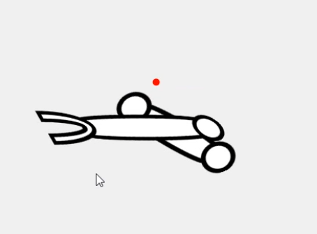
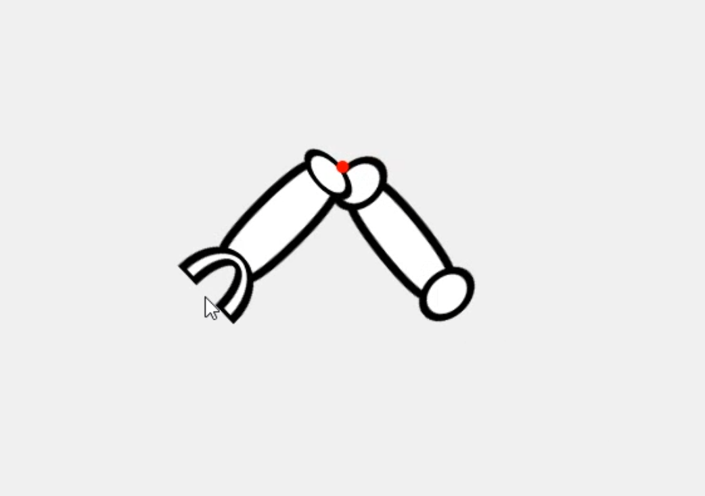

# Winform_RobotArmUI
윈폼으로 로봇팔 접었다 폈다 구현 방안 연구 리포지토리

### 왜 이 리포지토리를 만들었죠?
- CTC 만드는 데 사용할 로봇팔 UI 연구를 위해

### 참고 소스
- 어떻게 시작해야 하나 ppt로 그려 보면서 고민하다, 감사하게도 깃허브에서 로봇팔이 구현된 Unity 코드를 찾을 수 있었다.

- Github Id : [ctw0727](
https://github.com/ctw0727/2D_Robotic_Arm/blob/main/KR_RoboticArmPrecoding.cs)

## 1차. 로봇팔 구현하기
1. 오픈소스 덕에 로봇팔 구현 자체는 어렵지 않았다. 조금 고쳐서 나온 결과물
 [_link](./Resource.README/처음%20로봇팔.mp4)

https://github.com/user-attachments/assets/23728311-8e1a-47cb-ad5a-050c92f57d9a

2. 로봇팔 이미지를 넣었더니 구겨지더라, 이미지를 가로로 잘 돌려 둔 이미지를 활용하자.

3. 기존 ctc 샘플 이미지 위에 올려두기 까지 구현
[_link](./Resource.README/이미지%20로봇팔.mp4)

https://github.com/user-attachments/assets/13d923b8-6212-45fe-80df-80271a11bde4

